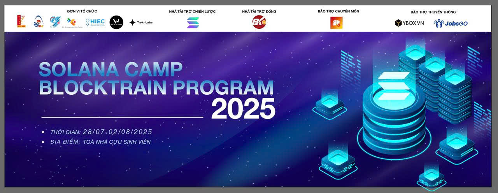

# Solana Camp - BLOCKTRAIN PROGRAM 2025

**Welcome to the Solana Camp - BLOCKTRAIN PROGRAM 2025 Repository!**

This repository contains sample code and exercises designed to guide you through the 4-days Solana development training session organized by SuperteamVN and Hanoi University of Science and Technology's Youth Union.

## Get Started

1. **Fork the Repository:** If you're a part of this class, kindly [fork](https://docs.github.com/en/get-started/quickstart/fork-a-repo#forking-a-repository) this repository.
2. **Set Your Fork to Public:** This helps us in evaluating and collaborating on your assignments.
3. **Syncing and Updates:** After every session, we will push relevant assignments here. Ensure you [sync your forked repository](https://docs.github.com/en/pull-requests/collaborating-with-pull-requests/working-with-forks/syncing-a-fork) to pull the exercise templates.

## Assignments Schedule

| Day | Topic                                               | Deadline   |
| --- | --------------------------------------------------- | ---------- |
| 1   | [Introduction about Solana](./week-1/assignment/README.md)        | 29/07/2025 23:59 |
| 1   | [Token & NFT](./week-2/assignment/README.md)                      | 30/07/2025 23:59 |
| 2   | [Build your first program](./week-3/assignment/README.md)         | 31/07/2025 23:59 |
| 3   | [Mobile development](./week-4/assignment/README.md) | 01/08/2025 23:59 |

Stay tuned for updates on future assignments!

## Assignment Submission

## Evaluation Criteria

We evaluate assignments based on the following criteria:

- **Timeliness**: The assignment must be submitted by the deadline (based on the time of the last commit in the assignment folder).
- **Requirements Fulfillment**: The assignment must fulfill all mandatory requirements.

Our team will carefully assess your submissions. After evaluation, we'll share the results and offer feedback on the corresponding open issue.

## Support

Should you have any questions or run into any issues, don't hesitate to reach out on [our Telegram](). We are happy to help!

Best of luck with your training! 🌟
